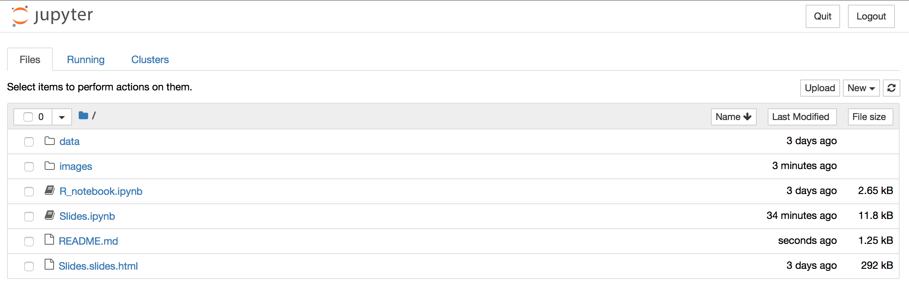
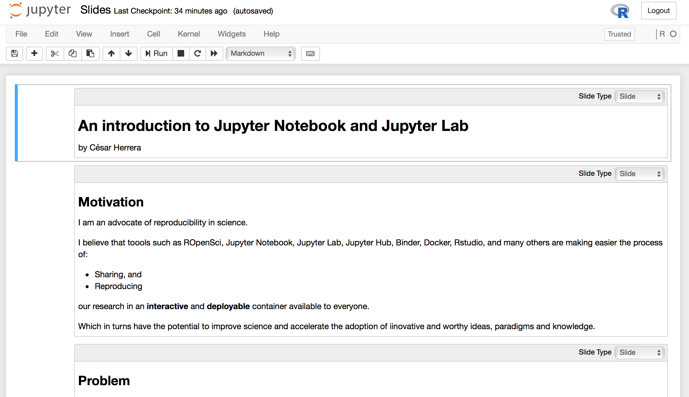

An introduction to Jupyter Notebooks and Jupyter Lab
======

This repository contains the material associated to the codeRtsv session about Jupyter Notebooks and Jupyter Lab by César Herrera.

## How to use:

### In the cloud:

To run this notebook in MyBinder.org please click the Binder badge at the top.

### In your computer:

You can run this repo locally. To do so you have to clone this repository to your computer. You will also need to install Python, R, Jupyter Notebook and the IRKernel. Use the Terminal/Console to navigate to the repository folder and run the command `jupyter notebook`. This command would open a new webpage with the dashboard showing the available files. It should look like the image below.

You can launch any of the notebooks (extension .ipynb) by clicking on their names. For instance, if you launch the notebook *Slides.ipynb* you will open a second webpage that should look like the image below.

Jupiter picture courtesy of NASA, [Cassini Jupiter Portrait](https://solarsystem.nasa.gov/resources/629/cassini-jupiter-portrait/)
